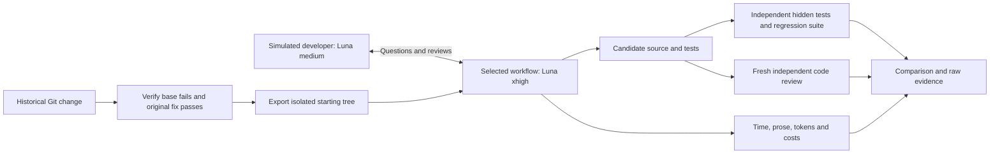

# Coding approach evaluation

Replay a historical task from its pre-change Git tree through four workflows:

1. **Prompt:** “Do the task. Here is the task.”
2. **Plan → implement:** a planning session, simulated developer review, then a fresh implementation session reading the saved plan.
3. **OpenSpec:** the pinned CLI's generated Codex proposal, apply, and archive skills, with developer review before apply.
4. **Gennady SDD:** setup, discovery, library decomposition, scaffolding, critique, then execution with fresh phase/audit sessions and typed handoffs.

The user simulator is **gpt-5.6-luna / medium**. Planning, implementation, workflow workers, and independent review use **gpt-5.6-luna / xhigh**. All model calls use Codex CLI and resume actual session IDs. No OpenAI API key is required beyond a working Codex login. Review ratings are model judgments; the reviewer uses an anonymous workspace and does not receive the reference fix.



## Explore the comparison

Open [the HTML comparison](reports/comparison/index.html) after running the report builder or extracting the evidence archive. It compares all four tasks against their original solutions, with separate Actual Budget initial and continuation phases, code diffs, coverage, quality evidence, foldable developer/agent conversations, and an artifact map of the test repositories and raw results.

```sh
# Rebuild from an existing portable result bundle: no model or test calls.
python3 reporting/build_report.py --from-data reports/comparison/data.json

# Build from this workspace's raw results and completed reference analysis.
.venv/bin/python reporting/build_report.py

# Share all evidence, then verify every archived file.
python3 reporting/archive_results.py --output exports/evaluation-results.tar.gz
python3 reporting/archive_results.py --verify exports/evaluation-results.tar.gz
```

See [reporting and restoration](docs/reporting.md) for reference measurements, archive extraction, exact source snapshots, preserved prompts, metric definitions, and limitations. A clean Git checkout contains the harness and report generator; measured results arrive separately in the archive. Python 3.12+ suffices to view/rebuild/export saved results. Executing model trials requires the pinned runtime and Codex login described below.

The completed continuation has **prompt, plan, and OpenSpec finished**; Gennady is **blocked with no feature implementation**. All three implemented candidates passed the seven common browser obligations on equivalent-control replay, with documented visual issues. See the [continuation comparison](studies/actual-balance-forecast/continuation-01/COMPARISON.md) and [workflow findings](studies/actual-balance-forecast/continuation-01/WORKFLOW_FINDINGS.md). Continuation effort is cumulative in the HTML report, not another independent trial.

## Project layout

| Path | Purpose |
|---|---|
| `approach_eval/` | Codex session orchestration, workflow prompts, isolation, grading, CLI |
| `tasks/`, `evaluation.json` | Public task briefs, evaluator commit metadata, pinned tools and model/budget settings |
| `scripts/`, `tests/` | Setup, import, calibration, review, and harness checks |
| `studies/actual-balance-forecast/` | Application adapter, browser harness, frozen study protocol, continuation code |
| `reporting/` | Original-solution analysis, source exports, offline report, verified sharing archive |
| `docs/` | Methodology, provenance, calibration notes, reporting guide |
| `runs/`, `studies/**/runs/` | Generated trials, prompts, sessions, workspaces, tests and reviews; outside Git |
| `analysis/`, `reports/`, `exports/` | Generated reference measurements, source snapshots, HTML/data, share archives; outside Git |

The repository stores authored code and configuration. Existing completed study engines and their prompts are additionally frozen inside their result directories and the share archive. Rebuilding a report does not change a frozen trial, rerun agents, or consume model quota.

## Run

The initial runner uses macOS Seatbelt and Apple Command Line Tools; other operating systems need a container/sandbox adapter. Use Python 3.12+ and Node 20.19+. This workspace's `.mise.toml` belongs to the existing directory; the harness does not change or trust it. Use the Python environment explicitly:

```sh
python3 scripts/bootstrap.py  # First setup on another machine, using Python 3.12+
.venv/bin/python -m approach_eval.cli doctor
.venv/bin/python -m pytest
.venv/bin/python -m approach_eval.cli list
.venv/bin/python -m approach_eval.cli validate
.venv/bin/python scripts/preflight.py  # One short Luna call exercising real runtime permissions
.venv/bin/python -m approach_eval.cli pilot --output runs/my-pilot --jobs 4
.venv/bin/python -m approach_eval.cli suite --pilot runs/my-pilot --output runs/my-suite --jobs 1
.venv/bin/python -m approach_eval.cli report runs/my-suite
.venv/bin/python scripts/complete_reviews.py runs/my-suite
.venv/bin/python scripts/review_context.py runs/my-suite
.venv/bin/python scripts/report_details.py runs/my-suite
```

The pilot draws one task using the saved seed and runs all four arms. The full matrix requires a passing pilot protocol/measurement gate for the current configuration, task set, workflows, and harness code. A poor solution does not fail the pilot gate; broken orchestration or missing measurements does. Completed run directories are retained, never silently overwritten. Use a new output directory when changing configuration or retrying an interrupted run.

To continue interrupted pilot artifacts, add `--recover-from runs/previous-pilot` with a new `--output` directory. Recovery is calibration only; the full matrix always starts fresh. Usage-limit errors receive bounded same-session retries, with interrupted usage flagged rather than silently omitted. Reset credits are never consumed automatically.

The initial full set is **3 tasks × 4 approaches × 1 repeat**. `evaluation.json` controls efforts, repeat count, time/token/interaction limits, seed, and explicitly dated cost assumptions. The default serial runner avoids concurrency affecting elapsed-time comparisons. `--jobs` permits concurrent runs and records the chosen concurrency.

## Tasks and evidence

| Task | Relative size | Historical change | Discriminating tests |
|---|---|---|---:|
| Copy function keyword defaults | Small | [Boltons #336](https://github.com/mahmoud/boltons/pull/336) | 1 |
| Classify iterable uniqueness | Medium | [more-itertools #777](https://github.com/more-itertools/more-itertools/pull/777) | 14 |
| Spooled stream compatibility | Larger | [Boltons #305](https://github.com/mahmoud/boltons/pull/305) | 6 |

Each manifest pins the exact base and fix commit. The issue brief is separate from evaluator-only metadata. The #336 PR description contains its implementation; the public brief removes that solution while retaining the reproduction. The feature brief describes the accepted `classify_unique` API rather than the superseded `is_unique_everseen` proposal.

Validation executes the baseline suite, applies only original test changes to the base, verifies that they fail, and verifies that the historical implementation passes. Existing baseline failures are reported separately. “Larger” is relative to this small Python-library set, not a claim to represent complex application work.

## Outputs

`runs/suite/COMPARISON.md` and `MEASUREMENTS.json` provide the detailed comparison; `REPORT.md` retains the basic execution report. Each run retains:

- `manifest.json`, `result.json`, stage outcomes, and the simulated developer conversation.
- Per-turn prompts, explicit runtime settings, raw JSONL, stderr, final responses, session IDs, duration, token usage, and cost estimates.
- The candidate Git snapshot and patch, including a changed-file inventory for untracked files.
- Independent hidden-test and regression trees, JUnit outcomes, agent-written test outcomes, branch/line coverage, and coverage of executable changed lines.
- A fresh independent model review of maintainability, readability, test quality, performance concerns, and security concerns, with evidence for each score.

See [methodology](docs/methodology.md) for what these metrics do and do not establish, and [workflow sources](docs/sources.md) for upstream versions and the local SDD example.

The [calibration log](docs/calibration-log.md) separates harness development attempts from the frozen evaluation matrix.

## Initial study results

The pilot gate passed, then all **12 fresh trials** ran. Every candidate passed its historical acceptance checks with zero new original-suite regressions. Nine workflows completed; the prompt stream run and Gennady iterable audit timed out, and the Gennady stream workflow stopped after its audit required an unavailable type checker.

| Approach | Completed workflows | Mean wall minutes | Mean estimated interaction minutes | Mean user words |
|---|---:|---:|---:|---:|
| Prompt | 2/3 | 5.5 | 2.6 | 77.0 |
| Plan → implement | 3/3 | 10.4 | 4.9 | 118.3 |
| OpenSpec | 3/3 | 16.8 | 4.5 | 124.7 |
| Gennady SDD | 1/3 | 87.7 | 14.2 | 269.7 |

Read the [full comparison](runs/suite/COMPARISON.md), [measurements](runs/suite/MEASUREMENTS.json), and [audit](runs/suite/AUDIT.json). The executed harness is archived in `runs/suite/frozen-harness/`. Both quality-review passes are retained for every candidate. No reset credit was used.

Passing historical checks does not prove every requirement is met: the plan→implement stream candidate still materializes both streams during equality comparison. The contextual reviewer identifies this gap. Human minutes are a summary-interaction estimate, prices are API-equivalent estimates, and interrupted usage is marked partial. Three public Python tasks, one repetition, and per-run workflow setup cannot establish a general winner.

A separate [Actual Budget application study](studies/actual-balance-forecast/README.md) is complete: [comparison](studies/actual-balance-forecast/COMPARISON.md), [browser/visual evidence](studies/actual-balance-forecast/QA_REPORT.md), and [audit](studies/actual-balance-forecast/AUDIT.json). Prompt, plan and OpenSpec passed seven common browser checks after adapting equivalent controls; their implementation calls timed out. Gennady reached the discovery-question cap without product code. Its selected reference declares AI assistance; these bounded results remain separate from the library matrix.

## Add your own completed task

Prepare a task brief describing the problem and desired behavior, removing implementation hints from the original PR. Supply the base commit, completed commit, changed original test files, and source roots:

```sh
.venv/bin/python scripts/add_task.py \
  --id my-task --repository /path/to/repository \
  --base BEFORE_SHA --fix COMPLETED_SHA \
  --brief /path/to/task.txt --project 'General project description' \
  --complexity medium --test-file tests/test_feature.py \
  --source-root my_package
```

The importer clones the repository into evaluator storage, resolves immutable commits, and registers the task only after its hidden tests distinguish base from completed code. A new pilot is required after changing the suite. This adapter currently supports Python package-source tasks with pytest-compatible tests. Use `--full-test-target` for projects with a different test layout.

## Continuing exhausted runs

The remaining library continuations are documented in [the continuation study](studies/library-continuation-01/README.md). It resumes the original spooled-I/O prompt session and the two suspended Gennady audit chains, keeping the calibration pilot separate from benchmark results. Each receives additional bounded budget; terminal original records remain unchanged. Actual Budget's already-completed continuation is not repeated.

After the runner and reviews finish, `studies/library-continuation-01/finish.py` publishes incremental/cumulative measurements. The HTML builder then imports these follow-ups automatically. Select **After continuation** for the updated library benchmark, or the explicitly labeled calibration phases to inspect the pilot.
